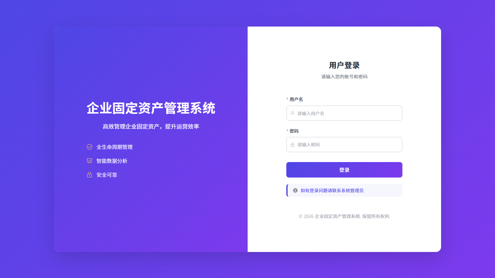

# 企业固定资产管理系统

## 1. 项目概述

企业固定资产管理系统是一个基于 **Spring Cloud Alibaba 微服务架构** 的企业级资产全生命周期管理平台，实现了对固定资产的采购入库、日常管理、折旧计算、盘点管理、维修报废等全流程管理。

系统已从单体应用拆分为微服务架构，包含认证服务和业务服务两个核心模块，通过 Nacos 实现服务注册与发现，使用 OpenFeign 进行跨服务调用。


### 系统界面预览（核心业务截图）



### 1.1 技术栈

**后端技术栈：**

| 分类 | 技术 | 版本 |
|------|------|------|
| 框架 | Spring Boot | 3.2.5 |
| 微服务 | Spring Cloud | 2023.0.1 |
| 服务注册 | Spring Cloud Alibaba Nacos | 2023.0.1.0 |
| 远程调用 | OpenFeign | 3.2.5 |
| 持久层 | Spring Data JPA | 3.2.5 |
| 数据库 | MySQL | 8.0+ |
| 安全 | Spring Security + JWT | - |
| 构建工具 | Maven | 3.9+ |
| Java版本 | JDK | 17 |

**前端技术栈：**

| 分类 | 技术 | 版本 |
|------|------|------|
| 框架 | Vue | 3.x |
| UI组件库 | Element Plus | 2.x |
| 状态管理 | Pinia | - |
| HTTP客户端 | Axios | - |
| 图表 | ECharts | - |
| 构建工具 | Vite | - |

---

## 2. 微服务架构

### 2.1 模块划分

```
enterprise-asset-management/
├── asset-auth/          # 认证服务（端口：8081）
│   ├── 用户管理
│   ├── 角色管理
│   ├── 权限管理
│   ├── 部门管理
│   ├── 系统日志
│   └── JWT认证
├── asset-business/      # 业务服务（端口：8082）
│   ├── 资产管理
│   ├── 资产折旧
│   ├── 资产盘点
│   ├── 资产业务申请
│   ├── 采购管理
│   ├── 报表统计
│   └── 仪表盘
├── asset-common/        # 公共模块
│   ├── DTO数据传输对象
│   ├── 枚举类
│   ├── JWT工具类
│   └── 统一返回工具
└── frontend/            # 前端服务（端口：5173）
```

### 2.2 服务职责

| 服务 | 职责 | 端口 |
|------|------|------|
| **asset-auth** | 用户认证、角色权限、部门管理、系统日志 | 8081 |
| **asset-business** | 资产管理、折旧计算、盘点管理、采购管理、报表统计 | 8082 |
| **Nacos** | 服务注册与发现 | 8848 |
| **frontend** | 前端页面展示与交互 | 5173 |

### 2.3 服务间调用

```
frontend ──→ asset-auth (认证、用户、部门)
    │              ↓
    └──→ asset-business (资产、折旧、盘点、采购、报表)
                   ↓
              AuthFeignClient (跨服务调用auth)
```

---

## 3. 系统功能模块

### 3.1 功能模块总览

```
├── 基础数据管理
│   ├── 部门管理
│   ├── 资产分类管理
│   ├── 员工信息管理
│   └── 供应商信息管理
│
├── 资产管理
│   ├── 资产登记
│   ├── 资产查询
│   ├── 资产编辑
│   └── 资产删除
│
├── 资产折旧
│   ├── 单资产折旧计算
│   ├── 批量折旧计算
│   ├── 折旧方法支持（直线法、双倍余额递减法、工作量法）
│   └── 折旧记录查询
│
├── 资产盘点
│   ├── 创建盘点计划
│   ├── 分配盘点任务
│   ├── 执行盘点
│   └── 盘点结果统计
│
├── 资产业务流程
│   ├── 资产领用申请
│   ├── 资产转移申请
│   ├── 资产维修申请
│   └── 资产报废申请（二级审批）
│
├── 采购管理
│   ├── 采购申请
│   ├── 采购审批
│   └── 采购订单
│
├── 报表统计
│   ├── 资产统计报表
│   ├── 部门资产分布
│   └── 资产状态分布
│
└── 系统管理
    ├── 角色管理
    ├── 用户管理
    └── 操作日志
```

### 3.2 角色权限体系

系统采用基于角色的访问控制（RBAC），包含四种角色：

| 角色 | 角色代码 | 权限说明 |
|------|---------|---------|
| 系统管理员 | ADMIN | 拥有系统所有权限 |
| 部门领导 | LEADER | 查看统计报表、审批报废申请 |
| 部门资产管理员 | MANAGER | 管理本部门资产 |
| 普通员工 | USER | 发起各类资产申请 |

---

## 4. 数据库设计

### 4.1 数据库配置

```properties
# 数据库连接信息
spring.datasource.url=jdbc:mysql://localhost:3306/asset_management
spring.datasource.username=root
spring.datasource.password=123456
```

### 4.2 核心数据表

#### 4.2.1 资产表（asset）

| 字段名 | 数据类型 | 说明 |
|--------|---------|------|
| id | BIGINT | 主键ID |
| asset_no | VARCHAR | 资产编号（唯一） |
| asset_name | VARCHAR | 资产名称 |
| category_id | BIGINT | 资产分类ID |
| model | VARCHAR | 规格型号 |
| purchase_price | DECIMAL | 购入价格 |
| original_value | DECIMAL | 原值 |
| net_value | DECIMAL | 当前净值 |
| supplier_id | BIGINT | 供应商ID |
| purchase_date | DATE | 购入日期 |
| useful_life | INT | 使用年限（月） |
| depreciation_method | VARCHAR | 折旧方法 |
| status | VARCHAR | 资产状态 |
| use_status | VARCHAR | 使用状态 |
| dept_id | BIGINT | 所属部门ID |
| user_id | BIGINT | 使用人ID |

#### 4.2.2 用户表（user）

| 字段名 | 数据类型 | 说明 |
|--------|---------|------|
| id | BIGINT | 主键ID |
| username | VARCHAR | 用户名（唯一） |
| password | VARCHAR | 密码 |
| real_name | VARCHAR | 真实姓名 |
| dept_id | BIGINT | 部门ID |
| role | VARCHAR | 角色代码 |
| status | INT | 账号状态 |

#### 4.2.3 部门表（department）

| 字段名 | 数据类型 | 说明 |
|--------|---------|------|
| id | BIGINT | 主键ID |
| dept_name | VARCHAR | 部门名称 |
| dept_code | VARCHAR | 部门编码 |
| parent_id | BIGINT | 上级部门ID |

#### 4.2.4 资产业务申请表（asset_application）

| 字段名 | 数据类型 | 说明 |
|--------|---------|------|
| id | BIGINT | 主键ID |
| asset_id | BIGINT | 资产ID |
| application_type | VARCHAR | 申请类型（领用/转移/维修/报废） |
| applicant_id | BIGINT | 申请人ID |
| status | VARCHAR | 状态 |
| approver_id | BIGINT | 审批人ID |
| approval_remark | TEXT | 审批备注 |

#### 4.2.5 资产折旧记录表（asset_depreciation）

| 字段名 | 数据类型 | 说明 |
|--------|---------|------|
| id | BIGINT | 主键ID |
| asset_id | BIGINT | 资产ID |
| depreciation_method | VARCHAR | 折旧方法 |
| depreciation_amount | DECIMAL | 本期折旧额 |
| accumulated_depreciation | DECIMAL | 累计折旧 |
| net_value | DECIMAL | 折旧后净值 |

---

## 5. API接口文档

### 5.1 认证接口（asset-auth）

| 接口路径 | 方法 | 说明 |
|---------|------|------|
| `/api/auth/login` | POST | 用户登录 |
| `/api/auth/logout` | POST | 用户登出 |
| `/api/auth/me` | GET | 获取当前用户信息 |
| `/api/auth/validate-token` | POST | 验证Token有效性 |

### 5.2 用户管理接口（asset-auth）

| 接口路径 | 方法 | 说明 |
|---------|------|------|
| `/api/users` | GET | 获取用户列表 |
| `/api/users/{id}` | GET | 获取用户详情 |
| `/api/users` | POST | 创建用户 |
| `/api/users/{id}` | PUT | 更新用户 |
| `/api/users/{id}` | DELETE | 删除用户 |

### 5.3 部门管理接口（asset-auth）

| 接口路径 | 方法 | 说明 |
|---------|------|------|
| `/api/departments` | GET | 获取部门列表 |
| `/api/departments/{id}` | GET | 获取部门详情 |
| `/api/departments` | POST | 创建部门 |
| `/api/departments/{id}` | PUT | 更新部门 |
| `/api/departments/{id}` | DELETE | 删除部门 |

### 5.4 资产管理接口（asset-business）

| 接口路径 | 方法 | 说明 |
|---------|------|------|
| `/api/assets` | GET | 获取资产列表 |
| `/api/assets/{id}` | GET | 获取资产详情 |
| `/api/assets` | POST | 创建资产 |
| `/api/assets/{id}` | PUT | 更新资产 |
| `/api/assets/{id}` | DELETE | 删除资产 |

### 5.5 资产折旧接口（asset-business）

| 接口路径 | 方法 | 说明 |
|---------|------|------|
| `/api/depreciation/calculate` | POST | 计算折旧 |
| `/api/depreciation/batch-calculate` | POST | 批量计算折旧 |
| `/api/depreciation/records` | GET | 获取折旧记录 |
| `/api/depreciation/summary` | GET | 获取折旧汇总 |

### 5.6 资产盘点接口（asset-business）

| 接口路径 | 方法 | 说明 |
|---------|------|------|
| `/api/asset-inventory/plans` | GET | 获取盘点计划列表 |
| `/api/asset-inventory/plans` | POST | 创建盘点计划 |
| `/api/asset-inventory/plans/{id}/assign` | POST | 分配盘点任务 |
| `/api/asset-inventory/plans/{id}/start` | POST | 开始盘点 |
| `/api/asset-inventory/plans/{id}/complete` | POST | 完成盘点 |

### 5.7 资产业务申请接口（asset-business）

| 接口路径 | 方法 | 说明 |
|---------|------|------|
| `/api/asset-applications` | GET | 获取申请列表 |
| `/api/asset-applications` | POST | 创建申请 |
| `/api/asset-applications/{id}/approve` | POST | 审批通过 |
| `/api/asset-applications/{id}/reject` | POST | 审批拒绝 |

### 5.8 采购管理接口（asset-business）

| 接口路径 | 方法 | 说明 |
|---------|------|------|
| `/api/purchase-requests` | GET | 获取采购申请列表 |
| `/api/purchase-requests` | POST | 创建采购申请 |
| `/api/purchase-requests/{id}/approve` | POST | 审批采购申请 |
| `/api/purchase-orders` | GET | 获取采购订单列表 |
| `/api/purchase-orders` | POST | 创建采购订单 |

### 5.9 报表统计接口（asset-business）

| 接口路径 | 方法 | 说明 |
|---------|------|------|
| `/api/dashboard/stats` | GET | 获取仪表盘统计 |
| `/api/dashboard/recent-operations` | GET | 获取最近操作 |
| `/api/reports/assets` | GET | 资产统计报表 |
| `/api/reports/departments` | GET | 部门资产报表 |

---

## 6. 核心业务流程

### 6.1 资产折旧流程

系统支持三种折旧方法：

1. **直线法**：每期折旧额 =（原值 - 残值）/ 使用年限
2. **双倍余额递减法**：年折旧率 = 2 / 使用年限 × 100%
3. **工作量法**：单位工作量折旧 =（原值 - 残值）/ 总工作量

### 6.2 资产盘点流程

```
创建盘点计划 → 分配盘点任务 → 开始盘点 → 执行盘点 → 完成盘点
     │              │              │            │            │
     ▼              ▼              ▼            ▼            ▼
   生成明细      记录日志      记录日志     更新明细     统计结果
```

### 6.3 资产报废流程（二级审批）

```
部门资产管理员申请 → 部门领导审批 → 资产报废
                        ↓
                   审批拒绝（可重新申请）
```

### 6.4 采购流程

```
采购申请 → 部门领导审批 → 生成采购订单 → 采购入库
```

---

## 7. 安全机制

### 7.1 JWT认证

```
用户登录 → 生成JWT Token → 前端存储Token → 后续请求携带Token → 服务端验证Token
```

### 7.2 跨服务认证

业务服务通过 Feign 调用认证服务的 `/api/auth/validate-token` 接口验证 Token 有效性。

### 7.3 权限控制

| 接口前缀 | 允许访问角色 |
|---------|-------------|
| `/api/admin/**` | ADMIN |
| `/api/leader/**` | LEADER, ADMIN |
| `/api/manager/**` | MANAGER, LEADER, ADMIN |
| `/api/assets/**` | USER, MANAGER, LEADER, ADMIN |

---

## 8. 配置说明

### 8.1 Nacos配置

所有服务需注册到 Nacos：

```yaml
spring:
  cloud:
    nacos:
      discovery:
        server-addr: localhost:8848
        username: nacos
        password: nacos
```

### 8.2 服务配置

**asset-auth（认证服务）：**

```yaml
server:
  port: 8081
spring:
  application:
    name: asset-auth
```

**asset-business（业务服务）：**

```yaml
server:
  port: 8082
spring:
  application:
    name: asset-business
```

### 8.3 前端代理配置

Vite 配置多代理，区分认证服务和业务服务：

```javascript
proxy: {
  '/api/auth': {
    target: 'http://localhost:8081',
    changeOrigin: true
  },
  '/api': {
    target: 'http://localhost:8082',
    changeOrigin: true
  }
}
```

---

## 9. 快速开始

### 9.1 环境要求

- JDK 17+
- MySQL 8.0+
- Node.js 16+
- Maven 3.9+
- Nacos Server 3.2+（服务注册与发现）

### 9.2 数据库初始化

```sql
CREATE DATABASE asset_management CHARACTER SET utf8mb4 COLLATE utf8mb4_unicode_ci;
```

### 9.3 启动步骤

#### 方式一：使用一键启动脚本（推荐）

```bash
# 双击运行或在命令行执行
start-all.bat
```

#### 方式二：手动启动

**1. 启动 Nacos：**

```bash
# 进入Nacos目录
cd D:\Users\30776\Downloads\nacos-server-3.2.2\nacos\bin

# 启动Nacos（单机模式）
startup.cmd -m standalone
```

**2. 编译项目：**

```bash
cd enterprise-asset-management
mvn clean install -DskipTests
```

**3. 启动认证服务：**

```bash
cd asset-auth
mvn spring-boot:run
```

**4. 启动业务服务：**

```bash
cd asset-business
mvn spring-boot:run
```

**5. 启动前端服务：**

```bash
cd frontend
npm install
npm run dev
```

### 9.4 访问地址

| 服务 | 地址 |
|------|------|
| Nacos控制台 | http://localhost:8848/nacos |
| 认证服务 | http://localhost:8081 |
| 业务服务 | http://localhost:8082 |
| 前端页面 | http://localhost:5173 |

### 9.5 默认账号

| 用户名 | 密码 | 角色 |
|--------|------|------|
| admin | admin | 系统管理员 |
| leader | leader | 部门领导 |
| manager | manager | 部门资产管理员 |
| user | user | 普通员工 |

---

## 10. 项目结构

### 10.1 后端模块结构

```
asset-auth/
├── controller/       # REST API控制器
├── service/          # 业务服务层
├── repository/       # 数据访问层
├── entity/           # JPA实体类
├── security/         # 安全认证模块
├── config/           # 配置类
└── AuthApplication.java

asset-business/
├── controller/       # REST API控制器
├── service/          # 业务服务层
├── repository/       # 数据访问层
├── entity/           # JPA实体类
├── client/           # Feign客户端
├── security/         # 安全认证模块
├── config/           # 配置类
└── BusinessApplication.java

asset-common/
├── dto/              # 数据传输对象
├── enums/            # 枚举类
├── security/         # JWT工具类
└── util/             # 公共工具类
```

### 10.2 前端项目结构

```
frontend/src/
├── views/            # 页面组件
├── components/       # 公共组件
├── router/           # 路由配置
├── config/           # 配置文件
├── utils/            # 工具函数
├── App.vue
└── main.js
```

---

## 11. 系统特性

### 11.1 核心特性

- **微服务架构**：基于 Spring Cloud Alibaba 的分布式服务架构
- **全流程管理**：覆盖资产从采购到报废的完整生命周期
- **多维度折旧**：支持直线法、双倍余额递减法、工作量法
- **智能盘点**：计划制定、任务分配、执行跟踪、结果统计
- **灵活审批**：支持多种审批流程配置
- **实时统计**：多维度的资产数据统计与分析
- **日志追踪**：完整的操作记录与审计追踪

### 11.2 安全特性

- JWT Token 认证
- 基于角色的访问控制（RBAC）
- 跨服务认证与授权
- 操作日志记录
- 跨域访问控制

### 11.3 架构特性

- Nacos 服务注册与发现
- OpenFeign 跨服务调用
- 服务间 Token 透传
- 统一异常处理
- 统一响应格式

---

## 12. 版本信息

- **项目版本**：0.0.1-SNAPSHOT
- **Spring Boot 版本**：3.2.5
- **Spring Cloud 版本**：2023.0.1
- **Spring Cloud Alibaba 版本**：2023.0.1.0
- **Vue 版本**：3.x
- **Element Plus 版本**：2.x

---

## 13. 许可证

本项目采用 MIT 许可证